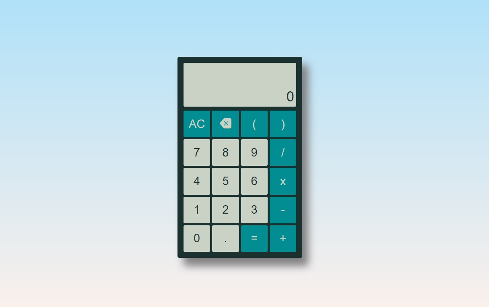

# CALCULADORA REACT

## LÓGICA

Calculadora básica feita em React. Possui os seguintes filtros:

- Não estrapola o tamanho da tela.
- Não permite repetir o operador indiscriminadamente.
- Se um operador for o último item digitado, um novo operador digitado o substitui.
- Utiliza a ',' para o cliente mas converte para '.' para o motor JS.
- Não permite utilizar a vírgula indiscrinadamente.
- Se a vírgula for o primeiro digito, acrescenta um '0' antes da mesma.

